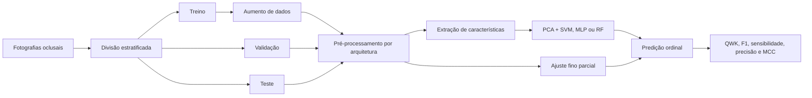

# Classificação Ordinal de Lesões de Cárie Dentária

> Pipeline de pesquisa para classificar a severidade de cárie em fotografias oclusais por meio de *transfer learning* e regressão ordinal.

[](https://www.python.org/)
[](https://www.tensorflow.org/)
[](#status-do-projeto)

## Visão geral

Este repositório reúne o pipeline experimental utilizado para classificar fotografias da superfície oclusal em três níveis ordenados de severidade:

```text
Hígido < Lesão inicial < Lesão cavitada
```

A formulação ordinal preserva a progressão clínica entre as classes e penaliza mais fortemente erros distantes. O notebook compara dez arquiteturas convolucionais pré-treinadas no ImageNet e dois paradigmas de modelagem:

- **abordagem híbrida:** CNN congelada como extratora de características, seguida por PCA e classificadores SVM, MLP ou Random Forest;
- **ajuste fino parcial:** adaptação das camadas superiores da CNN com uma saída ordinal baseada em `K - 1` probabilidades cumulativas.

> [!IMPORTANT]
> Este projeto é um protótipo de pesquisa e não constitui dispositivo médico, diagnóstico clínico ou recomendação terapêutica.

## Metodologia



A decomposição binária de Frank e Hall converte um problema com `K` classes ordenadas em `K - 1` classificadores binários. Para as três classes deste projeto, o modelo estima:

- `P(y > Hígido)`;
- `P(y > Lesão inicial)`.

As probabilidades cumulativas são então convertidas nas probabilidades das três classes finais.

### Arquiteturas avaliadas

| ID | Arquitetura | Entrada |
|---:|---|---:|
| 0 | VGG16 | 224 × 224 |
| 1 | VGG19 | 224 × 224 |
| 2 | ResNet50 | 224 × 224 |
| 3 | ResNet50V2 | 224 × 224 |
| 4 | InceptionResNetV2 | 299 × 299 |
| 5 | InceptionV3 | 299 × 299 |
| 6 | MobileNetV3Small | 224 × 224 |
| 7 | ConvNeXtSmall | 224 × 224 |
| 8 | EfficientNetV2B3 | 300 × 300 |
| 9 | EfficientNetV2B0 | 224 × 224 |

## Conjunto de dados

O estudo foi desenvolvido com **356 fotografias** categorizadas segundo os critérios visuais do ICDAS:

| Classe do projeto | Critério clínico |
|---|---|
| Hígido | ICDAS 0 |
| Lesão inicial | ICDAS 1–2 |
| Lesão cavitada | ICDAS 3–6 |

O conjunto institucional não é distribuído neste repositório por restrições éticas e de privacidade. Para executar o pipeline, organize um conjunto próprio da seguinte forma:

```text
<BASE_PROJECT>/
├── Dataset/
│   ├── Hígidos/
│   ├── Iniciais/
│   └── Severas/
├── features/
└── Metricas/
```

São reconhecidas imagens `.jpg`, `.JPG`, `.png` e `.PNG` diretamente dentro das pastas de classe. As pastas `features` e `Metricas` devem existir antes da execução.

## Estrutura do repositório

```text
.
├── Pipeline.ipynb      # Pipeline experimental e análises estatísticas
├── requirements.txt    # Dependências Python
└── README.md           # Documentação do projeto
```

## Instalação

### Pré-requisitos

- Python em versão compatível com TensorFlow 2.15;
- `venv` ou outro gerenciador de ambientes;
- GPU compatível com TensorFlow é recomendada para os experimentos completos, mas não obrigatória para explorar o notebook;
- espaço em disco para características, métricas e imagens aumentadas.

### Ambiente local

```bash
git clone https://github.com/larissatx11/Pesquisa-Odonto.git
cd Pesquisa-Odonto
python -m venv .venv
```

Ative o ambiente:

```bash
# Linux/macOS
source .venv/bin/activate

# Windows PowerShell
.venv\Scripts\Activate.ps1
```

Instale as dependências:

```bash
python -m pip install --upgrade pip
pip install -r requirements.txt
pip install scipy
```

## Configuração e execução

1. Crie a estrutura de diretórios indicada na seção [Conjunto de dados](#conjunto-de-dados).
2. Abra `Pipeline.ipynb` no JupyterLab, Jupyter Notebook ou VS Code.
3. Na célula de configuração, substitua `BASE_PROJECT` pelo caminho absoluto do seu projeto.
4. Revise `n_repeats`, `modelos_ids`, nomes das classes e hiperparâmetros antes de iniciar um experimento completo.
5. Execute as células em ordem.

Exemplo de configuração:

```python
BASE_PROJECT = r"C:\caminho\para\Pesquisa-Odonto"
DATASET_DIR = os.path.join(BASE_PROJECT, "Dataset")
FEATURES_DIR = os.path.join(BASE_PROJECT, "features")
METRICS_DIR = os.path.join(BASE_PROJECT, "Metricas")
```

O experimento completo combina 10 arquiteturas, 10 repetições, busca de hiperparâmetros e aumento de dados. O custo computacional pode ser elevado.

## Saídas geradas

Durante a execução, o notebook pode produzir:

- características e rótulos em arquivos `.npy`;
- caminhos das imagens de teste;
- métricas consolidadas em arquivos `.csv`;
- matrizes de confusão e visualizações de erros;
- testes de Friedman e Wilcoxon;
- intervalos de confiança por *bootstrap*;
- estimativas de tempo de treinamento e latência de inferência.

## Resultados relatados

Os experimentos destacaram:

- **EfficientNetV2B3** na abordagem híbrida;
- **VGG19** com ajuste fino parcial;
- F1-score, sensibilidade e precisão superiores a **81%** nos melhores cenários;
- *Quadratic Weighted Kappa* próximo de **0,84**;
- latência de inferência inferior a **100 ms** no ambiente avaliado.

Esses valores dependem do conjunto de dados privado, da divisão amostral, do hardware e da configuração experimental. Os artefatos de resultados e os dados necessários para reproduzi-los não estão versionados no repositório; portanto, os números devem ser interpretados como resultados relatados pelo estudo, e não como um *benchmark* reproduzível a partir deste código isoladamente.

## Status do projeto

O código encontra-se em estágio de **protótipo de pesquisa**. Antes de reutilizá-lo em novos estudos, recomenda-se:

- parametrizar caminhos e configurações fora do notebook;
- separar o pipeline em módulos testáveis;
- fixar todas as versões de dependências;
- validar a divisão por paciente ou dente, quando houver múltiplas imagens relacionadas;
- versionar configurações, sementes, métricas e artefatos de cada experimento;

## Ética, privacidade e uso responsável

As imagens odontológicas utilizadas no estudo estão sujeitas às determinações do Comitê de Ética em Pesquisa e não podem ser compartilhadas publicamente. Conjuntos substitutos devem ser tratados de acordo com a legislação aplicável, os termos de consentimento e as políticas institucionais de segurança e anonimização.

Qualquer avaliação clínica exige validação externa, análise de vieses, calibração, supervisão profissional e conformidade regulatória.

## Autores

Pesquisa desenvolvida na **Universidade Federal do Ceará**, nos campi de Crateús e Sobral, em colaboração com a **Faculdade de Farmácia, Odontologia e Enfermagem de Fortaleza** e instituições internacionais.

- Ana Larissa Teixeira Dantas
- Jadiel Silva da Cunha
- Julyana Raab Pereira
- Beatriz Gonçalves Neves
- Bruno Riccelli dos Santos Silva
- Adriana Pigozzo Manso
- Wellington Franco
- Lidiany Karla Azevedo Rodrigues
